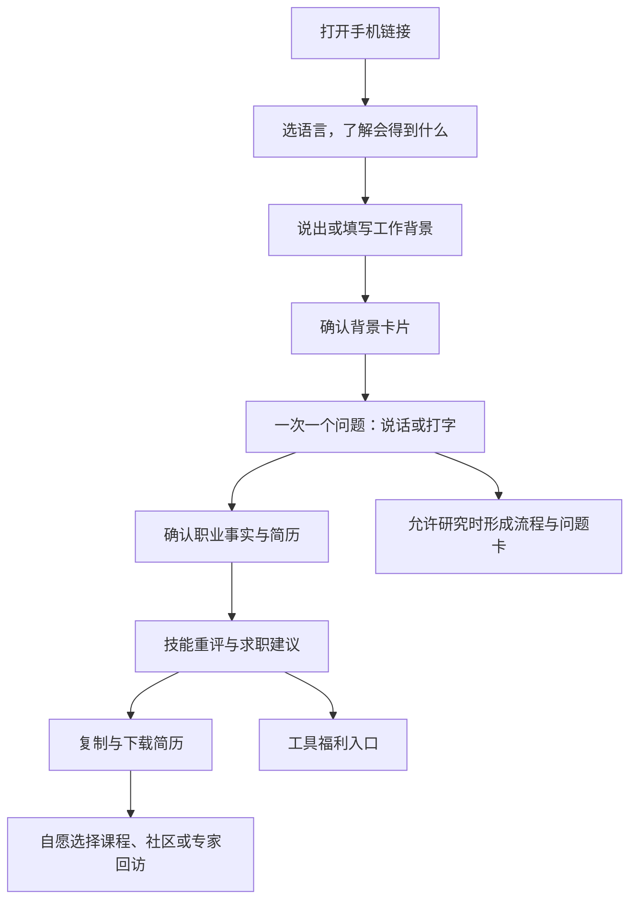

# 第一版开发方案：语音访谈、简历成果与行业问题获客

状态：开发规格与排期草案，尚未开始实现。第一期目标已更新为：用求职成果和真实工具福利获客，采集职业背景与行业问题，并形成本人允许的联系渠道。课程、社区与支付后置。详见[当前产品定义](./system-design.md)。

## 1. 本轮确认的范围

- 用户自行提供背景、LinkedIn URL 或其他个人简介；第一期不做个人 enrichment，不读取 LinkedIn 页面，不接 Apollo／Clay。
- 用户可以直接说出自己的经历；没有 LinkedIn、没有简历、不会复制链接，也能完成访谈。
- 优先适配手机与不熟悉数字工具的人。45–50 岁不代表能力弱，交互设计不根据年龄分配不同待遇。
- Muse 邀请码作为候选福利来源，Jobright.ai 作为待洽谈合作方；具体权益以核实后的活动为准。
- 首版交付技能重评、可编辑简历、纯文本复制、DOCX／PDF 下载、求职方向、福利领取与联系偏好；行业流程和具体问题采集进入首期主流程，并受研究用途选择控制。
- 本地文本 LLM 使用用户指定的中转站；配置和实测见[模型接入记录](./local-model-gateway.md)。语音转写需单独验证，不能从文本模型清单推断支持。

## 2. 第一版用户流程



首页只展示一个主行动：“整理我的经历，生成求职资料”。同时说明研究用途及其选择。首次输入不要求注册；后台以受限匿名会话保存已确认内容，需要跨设备恢复或领取受限福利时提供邮箱验证码登录。当前会话可以查看、复制和下载自己的结果；课程营销、社区邀请与专家回访单独选择。

LinkedIn URL 只是可选背景字段，旁边明示“这一步不会自动读取你的资料”。上传简历是可选辅助入口，首版支持文字 PDF 与 DOCX；扫描件识别失败时提示改用口述或粘贴，OCR 后续增加。

## 3. 界面原则与页面规格

采用安静、温暖、有清楚边界的视觉风格。正文基准 18px，输入文字至少 16px，主要触控区域至少 48×48 CSS px，充足行距，高对比度；这些是本产品设计目标。支持系统字体放大、200% 缩放、键盘与屏幕阅读器，不依赖颜色传达状态。

手机为单列；每屏一个问题、一个主要动作。桌面保留同样的核心结构，辅助摘要可以展开。主按钮固定在合适位置并避开软键盘和底部安全区。无自动播放、倒计时推销、强制滑动手势或只能长按的操作。

| 页面 | 用户看见什么 | 核心验收 |
|---|---|---|
| 首页 | 收益、预计时间、语言、开始按钮 | 不了解 AI 的人能说清楚接下来做什么 |
| 背景输入 | “最近主要做什么工作？”；说话／打字；可选链接与简历 | 不填链接、不上传文件也能继续 |
| 背景确认 | 职位、行业、主要职责等少量卡片 | 每个解析结果可以修改或标未知 |
| 访谈 | 当前问题、听问题、语音／文字输入、稍后继续、跳过 | 不需要反复滚动查找当前问题 |
| 结果 | 技能摘要、求职方向、简历入口 | 每个能力结论有本人案例；可以纠错 |
| 简历编辑与导出 | 事实补齐、草稿修改、确认、复制、DOCX／PDF 下载 | 不捏造事实；不同格式内容一致；PDF 文字可选择 |
| 福利与联系偏好 | 真实权益、兑换、保存结果、独立的后续联系选择 | 外部码失败不阻断成果，选择营销不与下载绑定 |
| 管理后台 | 职业档案、问题卡、授权、联系偏好、渠道与福利状态 | 根据用途筛选，不把全部联系人视为营销名单 |

结果默认用技能摘要、简历、求职方向三张简洁卡片展示，福利在相关位置呈现。详细流程和证据折叠。问题历史不挤占当前任务。英文为首个交付语言，西语从组件、内容 ID 和数据库层预留；完成母语校对与语音测试后开放西语试点。

## 4. 语音输入：第一版最重要的交互

### 使用流程

1. 用户点击“开始说话”，先看一句简短说明，再由浏览器请求麦克风权限；不请求相机。
2. 页面显示明确的录音状态、时间和“说完了”按钮；用户可随时取消。
3. 点击“说完了”后停止麦克风，显示“正在整理成文字”。在第一次使用的说明中告知音频会发送至语音识别服务处理。
4. 展示识别文字，提供“这样发送”“修改”“重新说”。此时尚未写入访谈事实。
5. 用户确认后，文字进入与键盘输入相同的访谈引擎。
6. 下一题显示文字。用户可点“听问题”；朗读由用户触发，开始录音前先停止朗读。

第一版不自动判断用户停顿就抢答，也不因为按了停止录音就提交回答。后续可根据真实测试加入更省步骤的模式，但必须保留纠错和撤回。

### 录音状态机

```text
idle → requesting_permission → recording → processing → review → sent
                       ↓            ↓          ↓          ↓
                    denied       canceled    failed     edited

denied / failed → 输入文字或由用户主动重试
recording → interrupted → 明确提示哪些片段仍在，允许重录
```

每段建议上限 90 秒，可继续补充；初始上传上限 8 MB，后端同时校验解码后时长、实际格式与大小。到上限后保留当前片段并进入检查，不静默丢弃。

### 技术实现

浏览器使用 `getUserMedia({audio: true})` 与 `MediaRecorder`。HTTPS 和用户许可是必要条件；录音格式用 `MediaRecorder.isTypeSupported()` 检测，实际 MIME、容器和服务端支持一致后才上传。不能固定假定所有手机都产出 WebM。[MDN 权限说明](https://developer.mozilla.org/en-US/docs/Web/API/MediaDevices/getUserMedia)、[格式检测](https://developer.mozilla.org/en-US/docs/Web/API/MediaRecorder/isTypeSupported_static)

使用服务端语音转文字接口。先核实用户中转站是否提供音频转写；目前只验证了文本聊天，模型列表中未发现明确的专用转写模型。若不支持，再选择单独的本地转写或经确认的音频服务。此前研究的 `gpt-transcribe` 仅为技术候选，不能自动绕过用户指定网关调用其他服务。[OpenAI 文件转写文档](https://developers.openai.com/api/docs/guides/speech-to-text)

浏览器内建 `SpeechRecognition` 不作为唯一实现，它的兼容性有限；用户手机键盘上的语音听写仍可以自然用于文字输入框。[MDN SpeechRecognition](https://developer.mozilla.org/en-US/docs/Web/API/SpeechRecognition)

“听问题”先用经过真机验证的浏览器朗读能力做渐进增强；没有相应语言的可用声音时保留文字并诚实提示。需要统一音色时，再接服务端 TTS。不能宣称所有浏览器都支持同样的语音体验。

### 中断、网络与隐私

- 浏览器拒绝录音、权限请求被忽略、设备无麦克风：立即提供文字路径，不锁住屏幕。
- 来电、锁屏、切应用、媒体轨道结束：检测到时停止或标记中断；保留能取得的片段。移动系统可能终止页面，未保存片段不能保证恢复，产品文案明确区分“已保存文字”和“未提交录音”。
- 弱网：上传／转写任务有 ID，断线后可查询状态；同一个任务的重试不生成多份回答。前端未提交录音可在当前页面暂存，不默认长久保存在设备上。
- 无声／只有噪声／识别结果可疑：请求重录或打字，不补写经历。关键数字和行业术语由本人确认。
- 默认只长期保留用户确认的文字。应用侧暂存音频在确认／取消后删除；失败或遗留文件目标 24 小时内自动清理。供应商保留策略另行核实，不把应用删除等同供应商零留存。
- 音频不用于推断年龄、情绪、性格或声纹身份；不会因为口音、说话速度或英文水平给用户能力打分。

## 5. 技术选型

| 模块 | 建议实现 | 原因 |
|---|---|---|
| Web 应用 | Next.js App Router + TypeScript | 手机和桌面一套代码；页面与服务端 API 放一个项目 |
| UI | 可访问的组件与统一设计 token，CSS 变量／Tailwind | 控制字号、间距、触控区域和多语言布局 |
| 数据、身份、文件 | Supabase Postgres、Auth、私有 Storage | 管理用户、会话、消息、计划、作品与临时音频 |
| 访谈逻辑 | 服务端状态机 + LLM 适配器 + schema 校验 | 模型负责候选抽取与表达，规则决定合法动作 |
| 语音 | MediaRecorder → 私有临时音频 → 服务端转写 | 可恢复、可纠错，不暴露模型密钥 |
| 任务执行 | 持久 job／outbox 表 + 后台 worker | 转写、解析和计划生成不依赖页面一直开着 |
| 简历导出 | 统一结构化简历 → 纯文本、DOCX、可选择文字的 PDF | 一份事实源、多格式模板，格式之间内容一致 |
| 联系管理 | 验证邮箱＋按用途记录联系偏好＋后台筛选 | 支持未来课程、社区与专家回访 |
| 部署 | HTTPS Web 托管 + 独立后台任务执行环境 | 录音需要安全上下文；后台任务具备超时重试能力 |
| 验证 | 单元／契约测试、浏览器流程测试、真人手机试用 | 分别验证逻辑、兼容性和可用性 |

Next.js Route Handlers 支持应用内服务端请求处理；长任务仍交后台 worker。[Next.js 文档](https://nextjs.org/docs/app/getting-started/route-handlers)

Supabase 的表访问授权和行级安全必须同时配置，按本人、导师和研究用途设计。私有文件通过权限检查或短时签名链接访问，不能放公共 bucket；服务端密钥不进入浏览器。[API 权限](https://supabase.com/docs/guides/api/securing-your-api)、[私有存储](https://supabase.com/docs/guides/storage/buckets/fundamentals)

未来实际收费时再接托管支付和 webhook，首期不把支付、商户账号或完整课程系统作为依赖。

模型名称、提示词版本、语言、耗时、调用费用写入运行记录。访谈模型先按结构化输出正确性、英西语体验与成本评测选定；本计划不凭型号宣称访谈质量已验证。

## 6. 服务端纵向链路

```text
文本回答 ─────────────────────────────┐
录音 → 上传 → 转写 → 用户确认文字 ────┤
                                    ↓
                 保存消息（幂等键、所有者、状态版本）
                                    ↓
                 抽取有原文依据的字段与候选问题
                                    ↓
                 校验来源、用途、重复问题与结束条件
                                    ↓
                   下一题 / 摘要确认 / 个人计划
```

只有用户确认后的语音文字进入证据层。纠正过去回答时提高会话版本，使依赖旧回答的计划进入待更新状态。摘要、计划和研究输出记录所用输入版本。

最小数据对象：`participants / purpose_grants / contact_preferences / sessions / messages / profile_facts / evidence_claims / skill_assessments / resume_versions / resume_exports / career_recommendations / workflow_steps / pain_points / expertise_profiles / jobs / reward_offers / reward_claims / source_attributions / audit_events`。音频附 `owner_id / upload_id / transcription_job_id / language / mime_type / duration / delete_after / status`。

新增语音接口：

- `POST /api/audio/uploads`：在本人会话内申请一次受限上传。
- `POST /api/audio/:id/transcriptions`：校验文件后建幂等转写任务。
- `GET /api/jobs/:id`：返回本人任务的进度与可确认文本。
- `POST /api/sessions/:id/answers`：统一接收用户确认的文字、来源与当前版本。
- `DELETE /api/audio/:id`：取消并删除本人的暂存片段，阻止排队任务继续使用。

开发时需验证各托管层的上传和超时限制；音频优先直接上传私有对象存储，再由 worker 读取，避免把录音文件挤进小容量 Web 请求体。

### 简历生成与导出契约

同一份结构化简历产生网页预览、纯文本、DOCX 和 PDF。每版保存目标岗位、语言、来源事实 ID、用户修改、复核状态和模板版本。导出任务绑定用户及具体版本；用户修正事实后，不允许旧生成任务把旧稿覆盖成最新稿。

状态为 `facts_incomplete → draft → fact_review → ready_to_export`；事实矛盾、未确认任期或占位符存在时保持草稿。只有用户确认后的内容可成为成稿，允许删除无关段落。公司名与日期属于简历必需信息时按需询问，不把它们设为所有研究问题的必填项。

新增接口：`POST /api/resumes` 生成草稿；`PATCH /api/resumes/:id` 保存本人编辑；`POST /api/resumes/:id/confirm` 完成事实确认；`POST /api/resumes/:id/exports` 创建格式化导出；`GET /api/exports/:id` 在权限检查后提供短时下载。幂等、版本控制、删除与用途权限沿用会话机制。

PDF 和 DOCX 不默认公开托管。验收覆盖英西语字符、长姓名、两页以上经历、分页、文字可选择、纯文本阅读顺序与复制结果。把导出文本与已确认事实对照，确认没有捏造数字、漏段或把未经核实的建议写成经历。

## 7. Muse 福利接入

已查看用户提供的 [Muse 邀请码页面](https://muse-codes.pages.dev/)：页面将自己描述为社区平台，并注明与 Meta 无关联；它说明每码可使用 30 次，显示余量依据反馈估算。这是该页面的陈述，不是本项目核验过的供应商承诺。

本次没有复制、领取、提交或试兑邀请码，也未验证具体额度、地区、有效期或分发规则。用户提供了明确来源，奖励条款核实仍是独立工作。

第一版支持两种福利类型：

1. **外部资源链接**：显示来源、步骤、可能失效的说明；跳转该社区自行获取。它是可用资源，不能包装成平台专属库存或保证兑现的奖励。
2. **运营方有权发放的码／链接**：后台录入活动、条款与凭据；展示适用地区、有效期、权益说明和状态。只在具备真实供应时展示可领取。

本地状态必须区分 `offered / assigned / opened / user_reported_success / user_reported_failed / provider_verified / unavailable`。复制、分配或跳转都不等于供应商成功兑换。

唯一一次性码采用事务预留防止重复分配；如果供应商允许一个码多次使用，记录其供应商规则和本地分配次数，并明确本地计数不是外部真实余额。没有核验接口时不能给“还剩 N 次”的确定数字。

UI 给出“复制邀请码”“打开兑换说明”“这个码无法使用”。后者进入支持流程；没有替代库存时如实说明，不无限循环发同一个失败码。

Apollo／Clay 仅作为后续可选适配器记录在待办，不安装、不接入，也不把公共职业数据供应商的结果自动当成用户确认事实。

Jobright.ai 已由用户确认为拟自行洽谈的候选合作方。后台先支持合作商、福利类别、目标地区、资格、活动条款、referral 链接、状态和有效期配置。状态为 `prospect / terms_pending / active / paused / expired`；只有真实权益核实且活动处于 active 时，才展示为可领取的合作优惠。该规划不表示已建立合作，也未向 Jobright 发送任何信息。

## 8. 开发任务与依赖

| 任务 | 内容 | 依赖 | 完成标准 |
|---|---|---|---|
| D01 | 手机页面原型、价值说明、录音与结果状态 | 无 | 能走通开始→访谈→简历→福利，覆盖取消／失败 |
| D02 | 数据、匿名会话、登录升级、用途权限 | D01 的流程定义 | 两个用户互相不可读；会话归属不丢失 |
| D03 | 文字访谈、字段抽取、摘要与结果 | D02 | 用合成案例完成一次真实后端链路，可纠错恢复 |
| D04 | 录音、转写、文字确认、音频清理 | D02、D03 | iPhone 与 Android 的完整路径及拒权兜底通过 |
| D05 | 自填资料、可选 PDF/DOCX 与后台质检 | D02、D03 | 解析失败仍可口述继续；后台看得见证据 |
| D06 | 技能重评、简历编辑、事实复核、纯文本／DOCX／PDF | D03、D05 | 用户能修改下载；内容一致；无虚构事实 |
| D07 | Muse／Jobright 等福利配置、领取与失败反馈 | D02；实际权益核实 | 未谈成的伙伴不展示为正式合作；兑换状态准确 |
| D08 | 邮箱保存、联系偏好、来源归因与后台筛选 | D02 | 课程、社区、专家回访分开记录，可撤回 |
| D09 | 授权下的行业采集、流程／问题卡和领域档案 | D03；研究用途选择 | 有原文依据；无研究用途则仅处理个人服务 |
| D10 | 真机、可访问性、成本观测、试访修正 | D01–D09 | 发布标准通过，关键错误清零 |

由于首版加入完整简历、多格式导出和领域档案，工程估算更新为 16–24 个工作日：交互原型 2–3 天，数据与访谈主链路 3–5 天，语音及资料输入 3–4 天，简历与导出 4–6 天，福利／联系后台及试访修正 4–6 天。前提是一个熟练工程师、必要外部服务可用、范围稳定；语音服务选择、伙伴洽谈、招募与外部审核不包含在工程时间内。这是规划估算，不是交付承诺。

最先交付的切片是“手机回答 → 真实经历被正确整理 → 能编辑和复制简历草稿”。语音接入同一答案接口。课程、支付、练习点评系统、完整社区、个人 enrichment、跨行业聚类与实时全双工语音后置；首版保留清楚的后续兴趣选择。

## 9. 发布标准

- 支持 360px 宽手机到桌面，无横向溢出；大字体、软键盘打开和屏幕旋转时主操作仍可用。
- 真实 iPhone Safari 和 Android Chrome 分别验证麦克风首次允许、拒绝、取消、录音中断、弱网、重试和西语文本输入；不把桌面模拟器当作真机验证。
- 从 LinkedIn 等 App 内置浏览器进入时检测能力；录音不可用则清楚指引改用文字或外部浏览器，不承诺所有内置浏览器都支持。
- 同一回答重发一次不会产生两条事实或跳两题；两个标签页不会覆盖彼此的状态。
- 转写需确认；录音结束、取消和离开时释放媒体轨道；后台音频清理有可核查结果。
- 不上传简历、不提供链接、拒绝研究、拒绝录音，都能走完职业访谈并获得免费结果。
- 三个真实价值交付可用：技能重评、可确认并复制／下载的简历、求职方向与实际可用的资源。课程、社区仅记录本人兴趣。
- Muse 链接点击和发码不被统计为真实兑换；无库存有明确回退。
- 试用至少 5 位自述不熟悉数字工具的目标用户，观察是否能独立完成；记录卡住位置和协助次数，而非只问喜不喜欢。
- 上线前权限、删除、供应商处理说明、简历导出和恢复流程通过检查；本次仅完成方案与中转站基础文本测试，尚未执行产品测试。

## 10. 开发配置与尚待落实的外部资源

先用合成资料开发原型。文本 LLM 已有用户指定中转站，三个候选通过基础调用测试；实际密钥只用于本地运行配置。仍需数据库／身份／存储、HTTPS 预览、邮件配置与语音转写服务。公网后端不默认能访问家中私网地址，部署前选定可达方案；不自动配置端口开放或隧道。

Muse 需要可发放权益的真实来源和条款；只有社区链接时启用外部资源模式。所有密钥通过部署环境配置，不写入仓库、前端或聊天。
