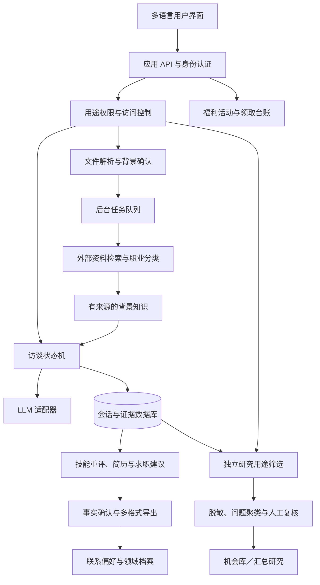

# 技术架构与数据契约

状态：供实现的设计，不是已运行系统。MVP 采用一个应用后端、关系数据库、私有对象存储和后台任务队列；模型、文档解析、简历导出和消息服务通过适配器接入。文本 LLM 本地开发使用[已测试的用户中转站](./local-model-gateway.md)；语音能力另行验证。课程与支付属于后续模块。

本轮具体技术选型、语音状态机、任务拆分与最新 MVP 范围见[开发方案](./development-plan.md)。以下外部背景补全架构保留为后续能力，第一期个人背景全部来自用户主动输入，LinkedIn URL 不读取，Apollo／Clay 不接入。

## 1. 系统边界



权限网关在查询、后台任务执行和导出时都检查。图中的研究模块无法绕过用途筛选读取职业档案。外部检索只使用必要的通用行业／岗位信息，不把整份简历发送到搜索引擎。

## 2. 用户端与运营端

用户端：语言与入门、资料确认、聊天与暂停、技能重评、简历编辑与导出、求职建议、福利、联系偏好、用途选择及下载／删除。练习、课程、支付与社区后置。

运营端：

- 招募漏斗：只保留最少来源信息、联系偏好、阶段；拒绝联系进入抑制名单，不能反复导入。
- 访谈质检：缺失字段、相互矛盾的说法、用户修正、来源定位；访谈内容按工作需要授权。
- 教学运营：班次、付费与退款、任务、反馈截止日期、导师容量和参与者时区。
- 研究工作台：仅授权材料的流程图、问题卡、原文证据、独立组织数、反例和研究用途。
- 奖励运营：真实库存、地区、有效期、领取状态、供应商履约失败。
- 权限运营：用途撤回、数据删除、导出审批、异常访问、供应商和模型版本。

课程导师默认看到学员选择共享的目标、作品与反馈，不看到完整裁员复盘。赞助商只见兑奖必要字段；商业报告买方默认只见经过审核的汇总内容。

## 3. 背景补全：四个层次

| 层次 | 输入与处理 | 可用于什么 | 不可做什么 |
|---|---|---|---|
| 用户直接资料 | 自填、简介、本人简历，解析并让本人确认 | 背景卡、个性化问题 | 把解析错误变成已确认事实 |
| 职业分类 | O*NET、ESCO 等，固定版本并遵守许可 | 候选任务和技能词汇 | 推断用户一定做过某任务 |
| 行业公开背景 | 有许可的公开来源、行业机构、供应商官方说明、企业公告 | 提问假设、术语解释 | 把行业趋势当成此人的裁员原因 |
| 个人补充确认 | 用户纠正职责、日期、工具和流程 | 更新个人事实与个性化计划 | 要求证明每一句话或提交雇主机密 |

O*NET 提供职业与任务数据；ESCO 提供跨语言职业和技能分类。[O*NET](https://www.onetcenter.org/database.html)、[ESCO](https://esco.ec.europa.eu/en/use-esco/download)

LinkedIn 链接先校验格式并作为用户提供的参考；第一期仅保存，不发起读取请求。若未来采购 Apollo、Clay 或其他资料服务，单独评估覆盖、授权、来源和地区适用性。普通 OIDC 登录不被当成履历同步或身份核验。

检索产生 `source_url / publisher / published_at / retrieved_at / jurisdiction / allowed_use / excerpt / query_context`。候选背景卡显示“行业参考，尚未由你确认”。企业同名或任期对不上时不合并。

速度：先用用户资料开始；后台补充最多几条高相关背景。外部检索失败不阻塞访谈。行业资料按地区、岗位、来源时间和许可缓存，个人资料不进入共享缓存。

## 4. 访谈状态机

```text
created → informed → intake → background_review → experience_interview
→ career_summary_review → resume_draft → resume_fact_review → export_ready

experience_interview → research_claims        [该用途当前允许]
research_claims → research_summary_review → research_ready

export_ready → benefits_viewed → contact_preferences_saved
export_ready → optional_deeper_interview       [本人选择及用途允许]

任何访谈中间状态 → paused → 原状态
任何状态 → deletion_requested → access_revoked → deletion_completed
```

职业成果、研究、福利与联系偏好是相关但独立的状态对象。拒绝研究或营销不影响基础求职成果。用户可在任何阶段保存草稿或查看已有结果；export_ready 指事实确认后的简历成稿，不代表用户必须先领取福利或填写联系偏好。

访谈结束条件：足以生成当前阶段成果、用户要求结束或达到时间预算。信息不够时交付草稿并列出缺口；完整简历必须有事实确认，不能把占位符或推测标为可投递内容。

### 逐轮处理

1. 客户端生成 `client_message_id`，服务器验证会话所有者、当前状态、用途和消息长度。
2. 单事务保存消息和事件，以唯一键去重；带 `expected_state_version` 防止两个标签页互相覆盖。
3. 解析明确的暂停、删除、撤回、跳题与切换语言操作。这些操作有 UI 按钮，不能完全依赖语义识别。
4. 提取本轮结构化候选声明，附原话 span。校验类型、引用、单位和授权范围。
5. 按字段冲突规则合并；记录用户修正对哪些下游对象造成影响。
6. 规则层选择下一个问题意图，LLM 负责自然表达。字段足够时转摘要确认。
7. 原子保存通过校验的状态、下一轮问题和事件；客户端显示结果。
8. 经 outbox 投递后台任务：计划草稿、必要检索、授权研究处理、指标更新。消费者按任务键幂等执行。

提取与表达可由一次模型调用生成候选输出，再由规则验证；如果问题不符合规则，用固定模板兜底或做一次有上限的修复。不要每轮同时调用多个独立模型角色。慢速检索、全量报告和跨用户聚类放后台。

## 5. 下一问策略

优先级从高到低：

1. 用户显式指令与用途权限变化。
2. 会改变职业计划的关键不确定性，如目标、可用时间、任务责任。
3. 相互矛盾的信息。
4. 一个能力所需的具体实例或一个研究问题所需的事实依据。
5. 尚有时间且用户愿意时的附加细节。

模型可以提出候选 `question_intent`，规则层必须检查是否已问、是否被拒绝、是否属于当前路径、是否会一次问多个问题。可解释原因采用 `goal_missing / example_needed / conflict_found / time_budget_reached` 等短代码；不存储模型隐藏推理。

职业路线不以补齐研究表为目的。研究路线也不能以证明 AI 替代为目标。

## 6. 数据模型：事实、推断和权限分开

数据库先使用关系表加结构化 JSON 字段。向量检索是辅助能力；聊天记录、同意记录和问题证据不能只存进向量库。初期不需要独立图数据库。

| 对象 | 关键字段与关系 |
|---|---|
| Participant | 内部 ID、语言、国家、时区、可选年龄段、联系偏好；身份信息在独立受限表 |
| PurposeGrant | 用途、法律依据记录、说明版本、选择、有效时间、撤回时间、选择发生位置 |
| SourceAsset | 类型、所有者、存储位置、提取状态、用途、保留期限、版本与来源 |
| ProfileFact | 候选值、字段状态、证据 ID、用户确认、修订历史 |
| CareerGoal | 目标、现实限制、时间预算、偏好、所选方向 |
| RoleExperience | 任期月份、地区、行业、原始职称、分类映射、职责；雇主标识可选且受限 |
| InterviewSession | 路径、语言、状态版本、所用提示词／模型版本、暂停点 |
| Message | 原文语言、脱敏显示版本、时间、客户端去重键、处理状态 |
| EvidenceClaim | 声明、声明类别、来源定位、用户确认、独立核验状态、允许用途 |
| Workflow / Step / Edge | 业务目标、步骤、输入、输出、工具、人、交接、异常路径；区分亲历与背景假设 |
| WorkChange | 发生时间、公司说法、本人观察、推断、技术部署阶段、未知因素 |
| PainPoint | 具体事例、频率区间、操作时间、等待、影响、解决办法、采用障碍、反例 |
| CareerPlan | 版本、用户确认、路径、任务、证据、未知、生成输入版本 |
| SkillAssessment | 技能陈述、来源事实、做过／自述／想学状态、本人纠正，不生成虚假认证 |
| ResumeVersion / ResumeExport | 目标岗位、语言、结构化内容、事实引用、用户修改、确认状态、格式及模板版本 |
| ContactPreference | 课程、社区、专家回访各自的选择、版本、生效与撤回时间；服务通知分开 |
| ExpertiseProfile | 熟悉流程、亲历边界、案例证据、工具与参与方式，不等同已核验专家身份 |
| PartnerOffer | Muse／Jobright 等候选、核实条款、地区、有效期、活动状态、领取方式 |
| Exercise / Submission / Review | 合成材料、评分标准、用户作品、版本、人工反馈、共享范围 |
| Cohort / Enrollment | 班级、语言、时区、导师、容量、入班状态、服务期 |
| Order / PaymentEvent | 报价版本、支付来源、状态、退款、事件幂等键 |
| Reward / Redemption | 供应商、条件、地区、有效期、库存、预留、一次性领取与履约状态 |
| ResearchCluster / Opportunity | 问题簇、引用、独立组织计数、不同观点、验证阶段、买方证据 |
| Export / DeletionJob | 包含哪些对象与版本、用途、审批、访问到期、撤回及删除状态 |

保存原文、标准化中文／英文术语和可选译文；数值带单位、币种、估计区间、地区、时间和是否自报。金额换算需记录汇率时间与来源；没有来源就保留原币种。工作时长和公司时间不可直接跨地区混算。

Exercise、Cohort、Enrollment、Order 等为后续实体，第一版不必建表。简历导出详情与接口以[开发方案](./development-plan.md)为准。职业资料只有在对应研究用途允许时才派生为研究声明；领取福利不自动新增营销权限。

### EvidenceClaim 示例

```json
{
  "id": "claim_demo_01",
  "participant_id": "p_demo",
  "statement": "通常每周处理约 20–30 次缺失交付文件的情况",
  "claim_type": "participant_report",
  "source": {
    "asset_id": "session_demo",
    "message_id": "msg_12",
    "quote": "Around twenty to thirty times a week.",
    "span_start": 0,
    "span_end": 37
  },
  "value": {"lower": 20, "upper": 30, "unit": "events_per_week"},
  "field_status": "captured",
  "participant_confirmed": false,
  "independently_verified": false,
  "allowed_purposes": ["internal_product_research"],
  "source_grant_id": "grant_demo",
  "observed_period": null,
  "source_quality": "self_reported_estimate",
  "needs_clarification": ["individual_or_team_count"]
}
```

`span_end` 使用原文 Unicode code point 的右开索引；实现需按这个约定校验。示例原话长 37 个字符。工程实现时还要保存原始语言与消息版本，避免译文或编辑使定位失效。

不要生成一个“可信度 0.93”假装已经校准。采用可审阅的来源种类、确认状态和实际核验结果。公司公告、同事转述、亲历、本人推断、模型假设分别存储；来源类型并不自动代表真假。

### 回合输出示例

```json
{
  "session_id": "s_demo",
  "based_on_state_version": 8,
  "track": "career",
  "claims": [],
  "field_updates": [
    {"field": "layoff_cause", "status": "unknown", "evidence_ids": ["e_demo_2"]}
  ],
  "next_action": {
    "type": "ask",
    "intent_id": "C06_JUDGMENT_EXAMPLE",
    "reason_code": "example_needed",
    "text": "Which part of that work needed your judgment most?"
  }
}
```

以上 JSON 展示契约形状，不是完整可执行 schema。实现需定义封闭枚举、引用校验、字段白名单与长度限制；拒绝任意 JSON Patch 路径，禁止模型修改身份、权限、价格或奖励。

## 7. 核心接口草案

| 接口 | 行为与关键保护 |
|---|---|
| `POST /sessions` | 选择语言与路径；建立临时会话；无需 LinkedIn |
| `POST /uploads` | 生成受限上传地址；只接收允许格式与大小；病毒扫描、隔离解析 |
| `POST /profile/confirmations` | 用户确认或纠正字段；记录版本，不能把修改直接当外部核验 |
| `POST /sessions/:id/messages` | 会话所有权、幂等键、版本检查、返回处理状态 |
| `GET /sessions/:id/events` | 授权后的流式响应与恢复游标；不重放其他用户消息 |
| `POST /sessions/:id/actions` | 暂停、跳题、结束、切语言；由规则层立即处理 |
| `POST /purpose-grants` | 保存分项用途选择与说明版本；不默认勾选研究或营销 |
| `POST /purpose-grants/:id/revoke` | 即刻撤销新用途访问并启动下游失效任务 |
| `GET /plans/:id` | 仅本人及明确获授权人员可见；注明草稿、确认或待更新 |
| `POST /submissions` | 保存作品与共享范围；支持私密提交 |
| `POST /checkout-sessions` | 使用服务端已发布报价、容量规则和退款说明 |
| `POST /payment-events` | 校验签名、事件去重、付款和退款状态机 |
| `POST /rewards/:id/claim` | 服务端资格校验、库存预留、一次性发放，失败可重试 |
| `POST /privacy/export` | 身份校验后异步导出本人资料，下载链接短时有效 |
| `POST /privacy/delete` | 即刻限制访问，随后跨存储删除，向本人展示进度 |

此表是接口设计，不表示任何接口已经部署。

## 8. 用途、隐私与全球化

### 用途隔离

| 用途 | 默认 | 对服务的影响 |
|---|---|---|
| 提供本人请求的访谈、计划和学习服务 | 在清楚告知后按适用处理依据执行 | 必需数据限定在实际服务范围 |
| 内部行业／产品研究 | 单独选择，默认关闭 | 不影响职业服务或已承诺权益 |
| 汇总商业研究报告 | 单独选择，默认关闭 | 不影响研究之外的服务 |
| 向项目方引荐本人 | 每次明确确认具体项目与分享内容 | 不自动共享联系方式 |
| 营销消息／合作商联系 | 单独选择，默认关闭 | 服务通知与营销分开 |
| 模型训练／微调 | MVP 关闭 | 不把购买课程视为训练授权 |

服务所需数据的处理依据不等于把所有用途都依赖一个同意框；上线时按公司所在地、服务对象、供应商和用途记录适用依据。以同意为依据时，必须能证明选择及其版本，并可撤回。[欧盟委员会说明](https://commission.europa.eu/law/law-topic/data-protection/information-business-and-organisations/legal-grounds-processing-data_en)

“去掉姓名”仍可能由公司、职称、城市、裁员时间重识别。带有可回连 ID 的数据继续按个人数据保护。[匿名与假名化的区别](https://commission.europa.eu/law/law-topic/data-protection/information-business-and-organisations/application-gdpr_en)

商业输出先只做人工审核的汇总报告，不提供个人履历库下载。建议初始导出保护：稀有组合合并或抑制；单元格少于 10 人或 3 家组织不展示；不默认发布逐字引语；限制重复细分查询并检查差分推断。**这些阈值只是设计护栏，不构成匿名化保证。** 还要评估外部信息、唯一事件、自由文本与小行业的重识别可能。

在适用 CCPA 的情况下，产品还需满足相应告知、权利处理及销售／分享退出要求；激励项目是否触发特别规则，应在确定方案和适用范围后核验。不能把“有一个同意框”当成全球合规。[加州官方说明](https://www.oag.ca.gov/privacy/ccpa)

### 留存与删除：拟议默认值

- 未保存的游客会话：7 天清理；页面提供主动删除。
- 原始简历：用户确认提取后 7 天内删除；未确认的上传文件最多 30 天；可提前删除。
- 原始访谈：默认 90 天；之后只保留服务必要、本人知情的摘要，另有明确需要才延长。
- 语音例外：应用侧暂存音频在确认／取消后删除，失败或遗留片段目标 24 小时内清理；已确认转写文字适用访谈留存政策。供应商侧保留需另行核实。
- 学习作品与反馈：服务期及结束后最多 12 个月供用户取回；用户可提前删除，法定记录单独处理。
- 研究记录：每 12 个月复核必要性及授权范围；不能无限期默认保存。
- 备份：目标 30 天轮换；删除标记必须在恢复时重新执行，防止数据复活。

这些是产品拟议期限，需与真实基础设施、供应商留存、合同和适用义务对齐后才能向用户承诺。

删除／撤回链：阻止新访问 → 暂停排队任务 → 删除或限制原文件、消息、摘要、检索索引和向量 → 使相关研究材料和缓存失效 → 重算仍可关联的汇总 → 撤销下载链接 → 通知需要处理的接收方 → 留最少操作审计。队列中的旧任务再次执行前检查当前授权版本，不能依赖入队时的授权快照。

已真正不可逆匿名化、无法再定位个人的统计，无法按个人撤回；这一边界提前说明。对仍有可识别关联的数据，不能以“已汇总”逃避处理。不得承诺技术上无法保证的互联网全网召回。

### 多语言与地区扩张

首轮默认美国英语；第二步可以在同一司法辖区验证西语服务，再按实际需求扩至西班牙等地区。西语使用者不能被自动归类为西班牙用户。欧洲也不能作为一个统一法律地区；逐一评估目标市场，包括英国与欧盟差异。

UI、问题库、同意说明和课程材料都版本化翻译。原文永久关联到对应声明；译文不覆盖原文。国家、语言、币种、日期与时区分别存储。

职业分类、岗位名称、证照要求和劳动情境需本地化。英语与西语用同一评估集检查：是否诱导、是否保留不确定性、数字单位是否一致、是否误把职业建议译成承诺。

部署和采购清单：数据所在地区、模型处理地点与保留、分包商、跨境传输安排、权利请求、地区退款条款与营销规则。欧盟服务不能仅通过选一个欧洲存储区就宣称解决了所有跨境问题。

## 9. 安全与可靠性

- 身份、联系方式与研究材料分离存储；传输和静态加密；用途与角色同时限制访问；管理员查看资料留下审计。
- 文件进行格式和大小限制、恶意文件扫描、沙箱解析；解析器不执行宏或任意链接。原始文件私有，下载使用短期授权。
- URL 检索限制域名／协议，阻止内网地址、任意跳转及 SSRF；简历中的网址不自动抓取。
- 资料与外部网页视为不可信输入；不得用其指令调用外部工具、发送邮件、授予访问或改变支付。
- 课程与研究检索在数据库条件层先过滤用途、所有者和当前授权，再检索；不能检索全库后要求模型“别泄漏”。
- 模型服务选用符合实际保留与训练要求的配置，签相应协议；未核实前不宣称供应商零留存。
- 支付使用托管结账，应用不保存卡片信息；一次性奖励码加密保存，日志不输出完整码。
- 模型输出不直接流式发布未经检查的计划结论。问题可以在验证后返回；生成失败保留已存消息并提供固定模板。
- 外部检索超时降级为已有资料；消息重试不重复追问；摘要可重建；支付重复事件不重复入班；领取失败不扣两次库存。
- 运营日志记录请求 ID、耗时、费用、模型版本和错误类型，默认不复制完整简历与聊天到第三方监控。

## 10. 行业知识汇总与机会筛选

流程：授权材料 → 声明与流程抽取 → 参与者确认 → 去识别化工作副本 → 规则字段及语义聚类 → 人工确认合并 → 保留原始证据与相反观点 → 经独立买方验证后升级机会。

聚类键包含 `行业细分 / 地区 / 流程步骤 / 问题触发 / 后果 / 公司规模 / 当前替代方案`。同一句“文档处理很慢”不足以合并理赔、合同和运单问题。

每份研究输出显示：样本期间、招募渠道、语言、授权样本数、独立组织数（可确定时）、拒答与缺失、同一裁员事件的集中程度、相反意见。不能把同事之间重复叙述计作多个独立公司证据。

失业者是有价值但有选择偏差的样本。为了做产品，补充当前在岗流程负责人；为了证明付费需求，补充预算方。不得从这份便利样本推断“整个行业有多少岗位会被 AI 取代”。

机会阶段：`reported_problem → corroborated_problem → buyer_checked → pilot_ready → pilot_completed / rejected`。阶段升级所需证据由研究员确认；模型只能建议。

排名维度各记 0–3 级的人工可解释评级：痛点影响、频率、现有方案缺口、买方证据、合法数据可得性、试点难度。首轮不加权生成貌似科学的单一投资分数。买方未知、数据拿不到或无法定义验收结果时，即使痛点强也留在探索阶段。

访谈来源的个人资料和学习成绩不用于向第三方输出“可雇佣性排名”。作品分享和专家撮合由参与者主动选择。

## 11. 观测、预算与质量评估

首期事件：`intake_started / background_confirmed / career_summary_confirmed / research_opted_in / problem_card_confirmed / resume_draft_viewed / resume_fact_confirmed / resume_copied / resume_exported / benefit_viewed / benefit_claimed / redemption_self_reported / contact_preference_changed / purpose_revoked / deletion_completed`。实际求职使用由本人另行反馈，导出不等于已投递。

事件包含匿名化程度适当的内部 ID、来源、路径、地区、语言、时间和版本；避免在分析事件里复制访谈文本。匿名用户跨设备合并只能在其登录并获得适当告知后进行。

首期成本：访谈与改写的模型调用 + 转写 + 文件解析／导出 + 存储 + 分摊质检 + 获客 + 实际福利成本。分别计算每份可用简历、每个研究授权档案与每张问题卡的成本；中转站不因部署在家中就被当作零成本。

初始限制建议：上传 10 MB 内、简历最多 10 页、每轮消息长度限制、每个主题最多两次追问、后台检索数量和重试上限、免费会话速率限制。数字根据真实试访调整；达到限制给可理解的替代路径。

质量验证分三层：

1. **契约测试：** JSON、单位、引用、状态机、权限、幂等、撤回传播、跨用户隔离、简历事实和奖励。采用真实风险场景，避免只复制实现逻辑。
2. **访谈评测：** 中英西样例中的事实忠实度、非诱导性、拒答尊重、目标覆盖、问题数、行动可执行性。覆盖 AI 无关裁员和不了解行业全链路的人。
3. **用户试访：** 能否纠错、是否理解用途、简历能否编辑导出、成果是否有用、问题是否具体、福利是否可用；由真人评价，不以模型评分替代。

首批 20 次访谈由人工检查计划与授权边界，之后按语言、路径和异常分层抽检。核心安全用例要求全过；抽取准确率等连续指标用试访校准后设发布线。暂不承诺未经测量的准确率和延迟。

## 12. 实现顺序

**P0，首期获客：** 手机逐题访谈、可纠错语音、自填／上传、职业事实、技能重评、简历编辑确认和导出、求职建议、授权行业采集、流程／问题卡、领域档案、福利配置与领取、联系偏好、运营后台、用途和删除。文本模型走用户网关；音频路径先核实。首个交付语言英语，西语完成同等测试后开放。

**P1，用户需求明确后：** 课程、练习与导师反馈、精简社区、支付、O*NET／ESCO 背景补全、问题卡跨访谈汇总。按实际需求确定顺序。

**P2，有持续需求后：** 多行业课程、多地区运营、问题聚类、研究报告导出、项目匹配、伙伴奖励门户。

**暂不构建：** 全网 LinkedIn 监听、自动群发、全球求职者资料库、无人工审核的研究商城、用户可雇佣性评分、自动决定裁员原因、无限制 AI 辅导聊天。
